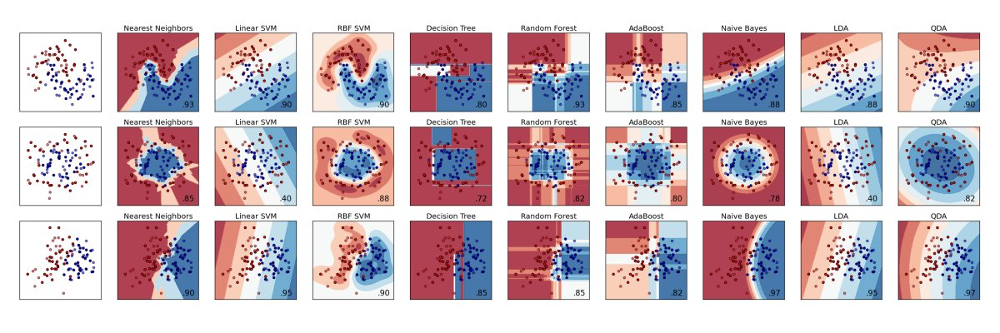

# Introduction to Implementing scikit-learn Classifiers

This tutorial is meant to serve as a demonstration of several machine learning classifiers, and { is inspired by | references | incoporates techniques from } the following excellent works:

* Randal Olson's [An Example Machine Learning Notebook](http://nbviewer.ipython.org/github/rhiever/Data-Analysis-and-Machine-Learning-Projects/blob/master/example-data-science-notebook/Example%20Machine%20Learning%20Notebook.ipynb)
* Analytics Vidhya's [Common Machine Learning Algorithms Cheat Sheet](http://www.analyticsvidhya.com/blog/2015/09/full-cheatsheet-machine-learning-algorithms/)
* Scikit-learn's official [Cross-validation Documentation](http://scikit-learn.org/stable/modules/cross_validation.html)
* Scikit-learn's official [Iris Dataset Documentation](http://scikit-learn.org/stable/auto_examples/datasets/plot_iris_dataset.html)
* Likely includes influence of the various referenced tutorials included in this [KDnuggets Python Machine Learning](http://www.kdnuggets.com/2015/11/seven-steps-machine-learning-python.html) article I recently wrote

We will use the well-known [Iris](https://archive.ics.uci.edu/ml/datasets/Iris) and [Digits](http://archive.ics.uci.edu/ml/datasets/Pen-Based+Recognition+of+Handwritten+Digits) datasets to build models with the following machine learning [classification](https://en.wikipedia.org/wiki/Statistical_classification) algorithms:

* [Logistic Regression](https://en.wikipedia.org/wiki/Logistic_regression)
* [Decision Tree](https://en.wikipedia.org/wiki/Decision_tree)
* [Support Vector Machine](https://en.wikipedia.org/wiki/Support_vector_machine)
* [Naive Bayes](https://en.wikipedia.org/wiki/Naive_Bayes_classifier)
* [k-nearest Neighbors](https://en.wikipedia.org/wiki/K-nearest_neighbors_algorithm)
* [Random Forests](https://en.wikipedia.org/wiki/Random_forest)

We also use different strategies for evaluating models:

* [Separate testing and training datasets](https://en.wikipedia.org/wiki/Test_set)
* [k-fold Cross-validation](https://en.wikipedia.org/wiki/Cross-validation_(statistics)

Some simple data investigation methods and tools will be undertaken as well, including:

* Plotting data with [Matplotlib](http://matplotlib.org/)
* Building and data via [Pandas](http://pandas.pydata.org/) dataframes
* Constructing and operating on multi-dimensional arrays and matrices with [Numpy](http://www.numpy.org/)

This tutorial is brief, non-verbose, and to the point. Please [alert me](https://twitter.com/mattmayo13) if you find inaccuracies. Also, if you find it at all useful, and believe it to be worth doing so, please feel free to share it far and wide.
